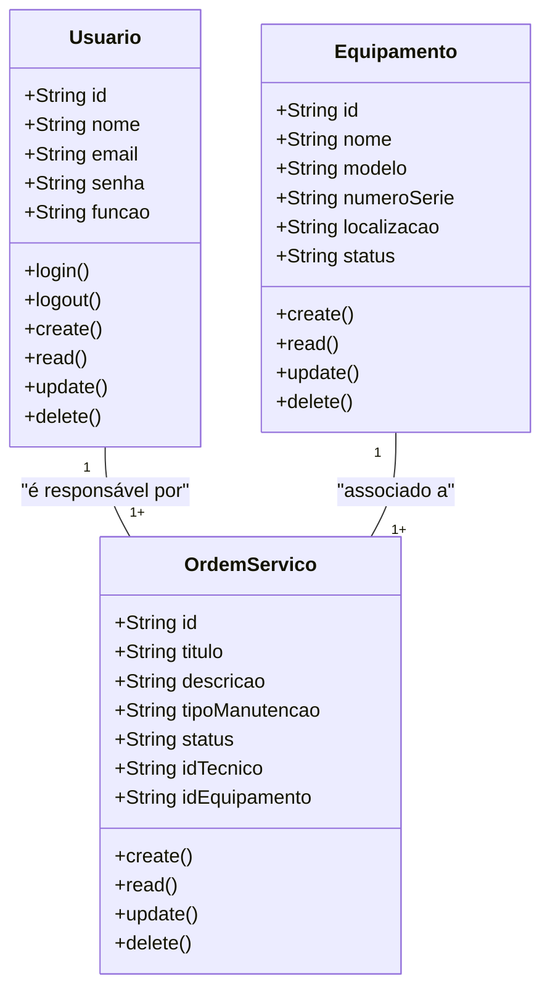

# Sistema de Gestão de Manutenção

## Briefing

### Visão Geral do Projeto
O projeto consite mo desenvolvimento de um sistema de gestão de manutenção (SGM) no formato de uma aplicação web.

## Escopo

- ### Objetivos:
    - Técnicos de Manutenção
    - Gestores de Manutenção
    - Administradores do Sistema

- ### Recursos Tecnológicos:

## Diagramas (Mermaid, Miro, Draw.io)

1. ### Diagrama de Classes
Este Diagrama modela as principais entidades do sistema:
- Usuários (user/Usuarios);
- Máquinas/Equipamentos (Equipment);
- Ordem de Serviço(Service);

