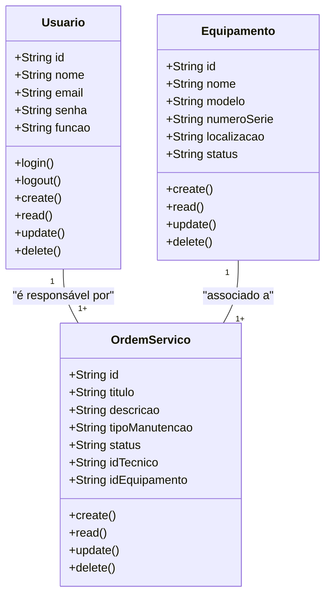
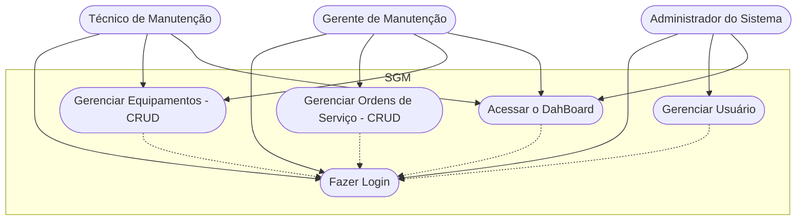

# Sistema de Gestão de Manutenção

## Briefing

### Visão Geral do Projeto
O projeto consite mo desenvolvimento de um sistema de gestão de manutenção (SGM) no formato de uma aplicação web.

## Escopo

- ### Objetivos:
    - Técnicos de Manutenção
    - Gestores de Manutenção
    - Administradores do Sistema

- ### Recursos Tecnológicos:

## Diagramas (Mermaid, Miro, Draw.io)

1. ### Diagrama de Classes
Este Diagrama modela as principais entidades do sistema:
- Usuários (user/Usuarios);
- Máquinas/Equipamentos (Equipment);
- Ordem de Serviço(Service);

#### Explicação do Diagrama de Classe
- Um Usuário (Técnico) por ser responsável por várias Ordens de Serviço
- Um Equipamento por estar associado a várias Ordens de Serviço

2. ### Diagrama de Caso de Uso
Ilustrar as interações dos diferentes tipos de usuários (atores) com as funcionalidades do sistema

#### Explicação do Diagrama de Classe
- Atores: Técnico, Gestor, Admin

- Casos de Usos:
    - Técnico: Gerenciar Ordens de Servico e acessar o DashBoard
    - Gestor: Gerenciar Ordens de Servico (CRUD), Gerenciar Equipamento (CRUD)
    - Admin: Gerenciar Usuário, acessar o DashBoard

    Fazer o Login -> Antes de Qualquer Ação

