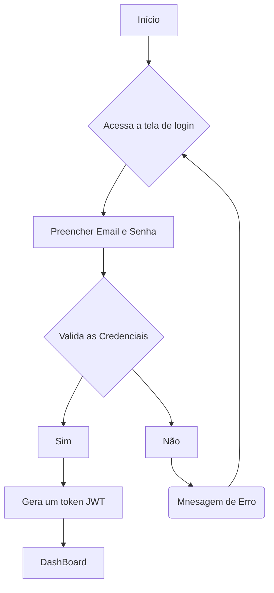

# Sistema de Gestão de Manutenção

## Briefing

### Visão Geral do Projeto
O projeto consite mo desenvolvimento de um sistema de gestão de manutenção (SGM) no formato de uma aplicação web.

## Escopo

- ### Objetivos:
    - Técnicos de Manutenção
    - Gestores de Manutenção
    - Administradores do Sistema

- ### Recursos Tecnológicos:

## Diagramas (Mermaid, Miro, Draw.io)

1. ### Diagrama de Classes
Este Diagrama modela as principais entidades do sistema:
- Usuários (user/Usuarios);
- Máquinas/Equipamentos (Equipment);
- Ordem de Serviço(Service);

#### Explicação do Diagrama de Classe
- Um Usuário (Técnico) por ser responsável por várias Ordens de Serviço
- Um Equipamento por estar associado a várias Ordens de Serviço

2. ### Diagrama de Caso de Uso
Ilustrar as interações dos diferentes tipos de usuários (atores) com as funcionalidades do sistema

#### Explicação do Diagrama de Classe
- Atores: Técnico, Gestor, Admin

- Casos de Usos:
    - Técnico: Gerenciar Ordens de Servico e acessar o DashBoard
    - Gestor: Gerenciar Ordens de Servico (CRUD), Gerenciar Equipamento (CRUD)
    - Admin: Gerenciar Usuário, acessar o DashBoard

    Fazer o Login -> Antes de Qualquer Ação

3. ### Diagrama de Fluxo (Login e Acesso ao DashBoard)
Detalhar o passo a passo que um usuário segue para se autenticar no sistema a acessar o dashboard

#### Explicação:
- O Fluxo começa quando o usuário acessa a tela de login
- Insere as credenciais(email e senha)
- O sistema verifica se as credneciais são válidas
    - se sim: gera um JWT (token) => dashboard
    - se não: mensagem de erro e o usuário permanece na tela de login

--- 

## Análise de Risco

### Matriz de Análise de Risco do Projeto SGM

A tabela abaixo apresenta os riscos identificados no projeto **SGM**, organizados por categoria, junto com a probabilidade, impacto e estratégias de mitigação propostas.

---

### Riscos Técnicos

| ID  | Risco                                     | Probabilidade | Impacto | Mitigação |
|-----|-------------------------------------------|---------------|---------|-----------|
| 1   | Chave secreta do JWT comprometida         | Média         | Alto    | Utilizar chaves secretas longas e complexas, armazená-las em variáveis de ambiente e implementar política de rotação de chaves. |
| 2   | Vulnerabilidade de truncamento do Bcrypt  | Baixa         | Alto    | Garantir que a entrada para o hashing de senha nunca exceda 72 bytes e tratar a senha de forma isolada, sem concatenação. |
| 3   | Lentidão do sistema com aumento de dados  | Média         | Média   | Otimizar consultas com indexação, implementar paginação e planejar arquitetura para escalabilidade futura. |
| 4   | Código de baixa qualidade com bugs        | Alta          | Média   | Adotar práticas de código limpo, revisões de código (code review) e testes unitários e de integração contínua. |

---

### Riscos de Gerenciamento

| ID  | Risco                             | Probabilidade | Impacto | Mitigação |
|-----|-----------------------------------|---------------|---------|-----------|
| 5   | Aumento do escopo (Scope Creep)   | Alta          | Média   | Formalizar processo de controle de mudanças e avaliar impacto em prazo/custo antes da aprovação. |
| 6   | Atraso na entrega do projeto      | Alta          | Média   | Utilizar metodologias ágeis, reavaliar cronograma a cada sprint e manter comunicação transparente sobre progresso. |
| 7   | Requisitos mal interpretados      | Média         | Alto    | Validar protótipos e wireframes com usuários finais e manter comunicação constante para esclarecimento. |

---

### Riscos Organizacionais

| ID  | Risco                                    | Probabilidade | Impacto | Mitigação |
|-----|------------------------------------------|---------------|---------|-----------|
| 8   | Resistência dos usuários à nova ferramenta | Média       | Alto    | Envolver usuários-chave desde o início, criar interface amigável (UI/UX) e comunicar benefícios do sistema. |
| 9   | Inserção de dados incorretos no sistema  | Média         | Alto    | Implementar validações robustas nos formulários e, se possível, importar/validar dados existentes. |
| 10  | Falta de treinamento para os usuários    | Média         | Média   | Criar manuais de usuário, realizar treinamentos práticos por perfil (técnico, gestor, administrador) e oferecer suporte. teste |

---