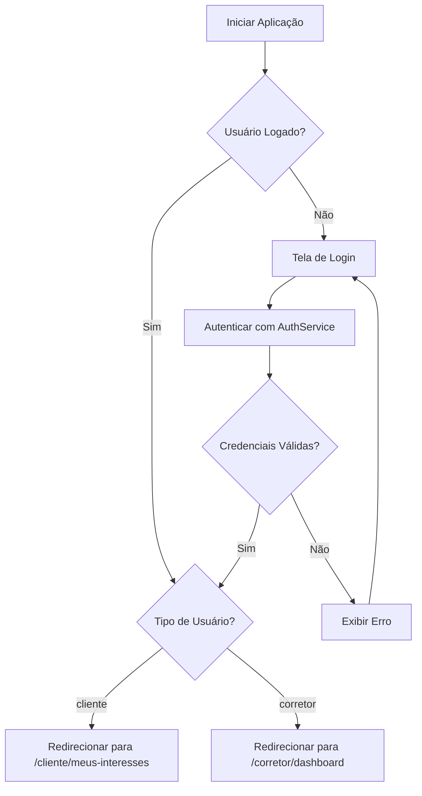
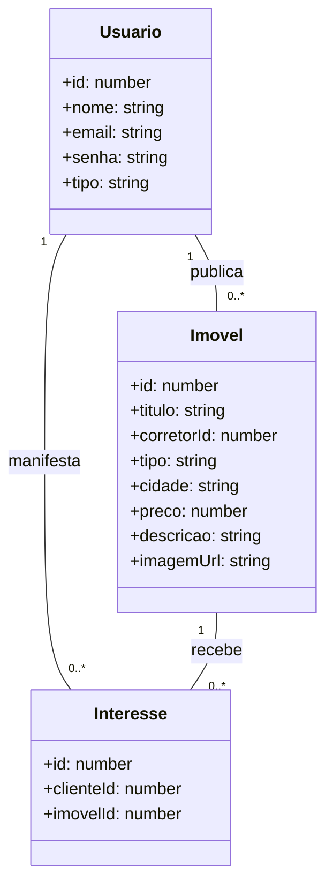
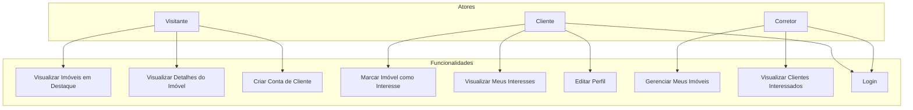

# 🏠 Imobiliária Prime

> Uma plataforma Angular para gestão de imóveis com autenticação por perfil (cliente e corretor).

Este projeto demonstra os principais conceitos do **Angular** — como componentes, serviços, roteamento com guardas, comunicação com API via `HttpClient`, e arquitetura baseada em perfis — aplicados a um cenário real: uma imobiliária digital.

---

## 🎯 Objetivo

Desenvolver uma **Single Page Application (SPA)** que permita:

- **Corretores** gerenciarem seus imóveis (CRUD).
- **Clientes** pesquisarem imóveis e manifestarem interesse.
- **Visitantes** visualizarem imóveis em destaque sem login.
- Controle de acesso seguro com **autenticação e autorização por perfil**.

---

## 📋 Funcionalidades

| Perfil       | Funcionalidades |
|--------------|-----------------|
| **Visitante** | Visualizar imóveis em destaque, detalhes de imóvel, criar conta de cliente |
| **Cliente**   | Marcar imóveis como "Tenho Interesse", ver lista de interesses, editar perfil |
| **Corretor**  | CRUD de imóveis, visualizar clientes interessados |

---

## ⚙️ Tecnologias Utilizadas

- **Frontend**: Angular 17+ (com Standalone Components)
- **Estilização**: SCSS
- **Formulários**: Reactive Forms
- **Comunicação com API**: `HttpClient` + RxJS (`Observable`)
- **Backend simulado**: [JSON Server](https://github.com/typicode/json-server)
- **Autenticação**: `localStorage` + `AuthService`
- **Proteção de rotas**: Guardas de rota (`CanActivateFn`)
- **Identidade Visual**:  
  - Verde-esmeralda: `#009B77`  
  - Cinza-escuro: `#333333`  
  - Branco: `#FFFFFF`

---

## 📁 Estrutura do Projeto

```bash
src/
└── app/
    ├── core/          
    │   ├── guards/    
    │   ├── services/  
    │   └── models/    
    ├── views/          
    │   ├── public/    
    │   ├── cliente/   
    │   └── corretor/  
    └── templates/     
        ├── components/
        └── pipes/     
```

---

## Diagrama de Fluxo 



---

## Diagrma de Classes



--- 

## Diagrama de Uso

